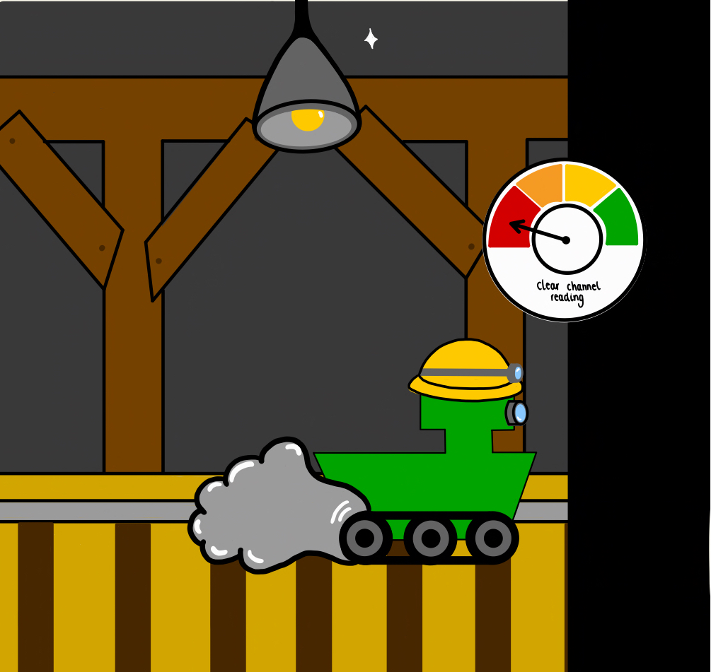
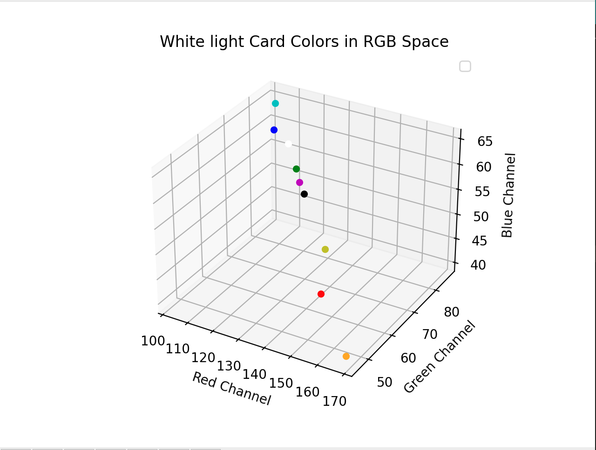
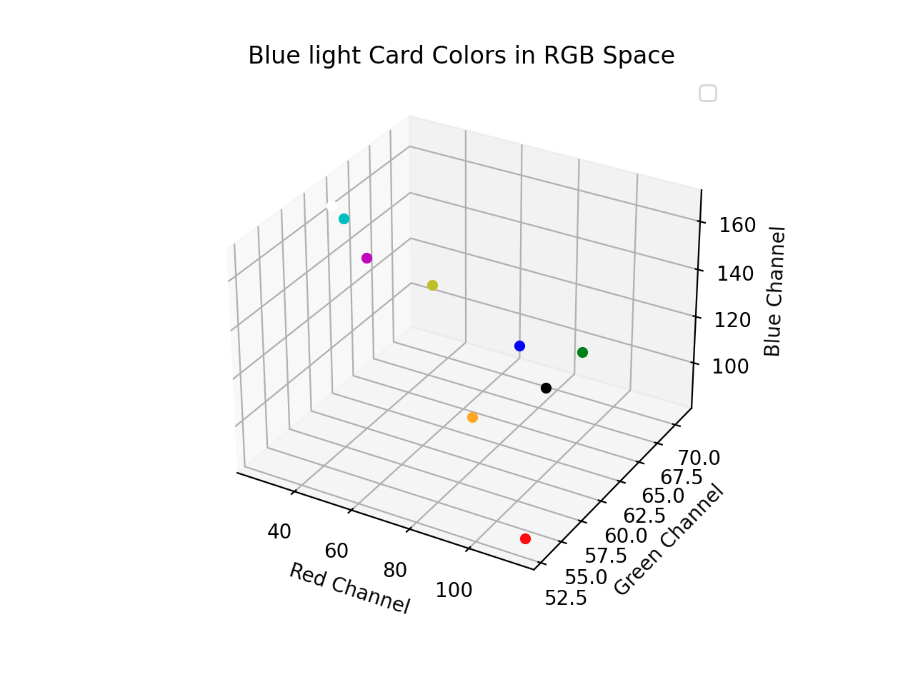
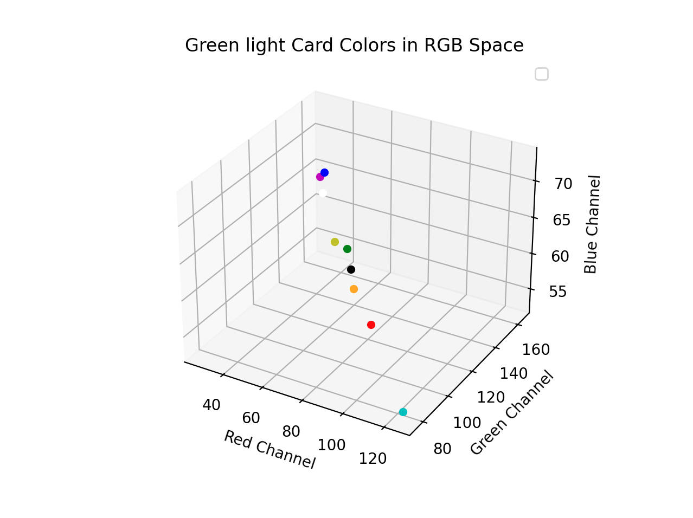
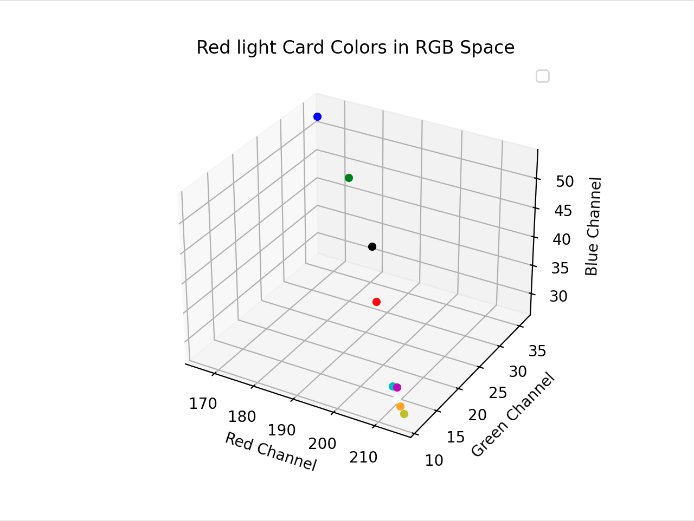
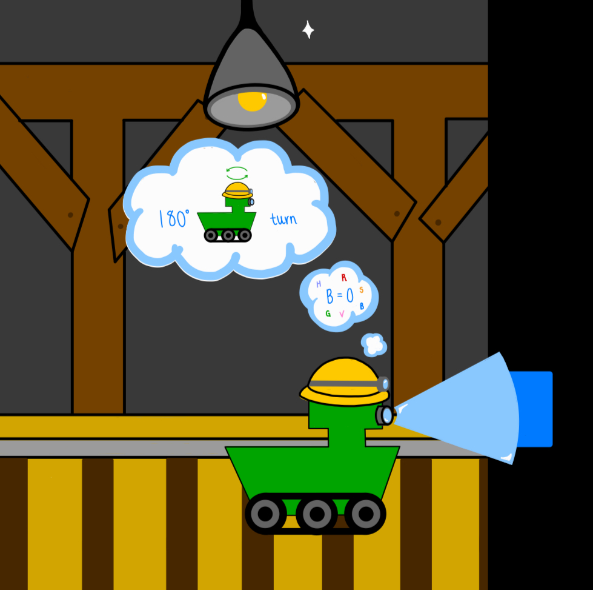
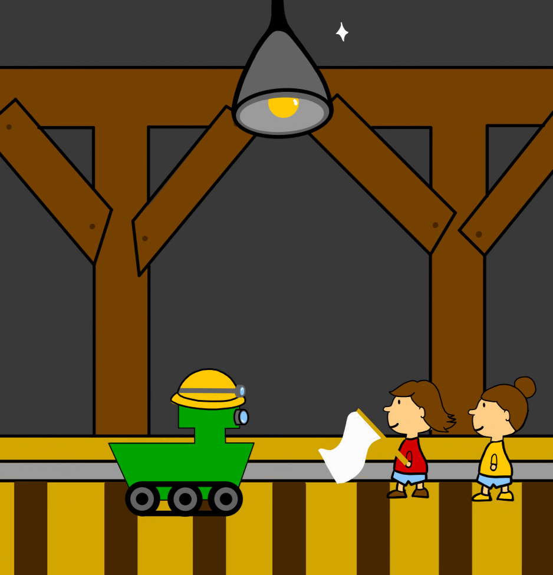

## Project PIC-axe: PIC-ing up the survivors

Developed by Orla Johnson and Jaime Lopez as part of an Embedded C course at Imperial College London, this project implements a PIC18-based robotic buggy that solves and retraces a colour-coded maze. 
The full codebase is held in a private Imperial College repository; this page provides a technical overview and selected excerpts. Drawings by Orla Johnson.

The main aim of this project was to create an autonomous robot that can navigate a "mine" using a series of instructions coded in coloured cards and return to its starting position. Throughout the project different approaches were attempted (e.g. autonomous calibration (Key Commit 1), HSV conversion (Key Commit 2), interrupts (Key Commit 3), individual LED color reading (Key Commit 4). However the following solution gave the most reliable functionality. For completeness this README will highlight commits where these features were implemented for potential future development. 

### Contents
1. How it Works
2. Calibration and Use
3. Videos and Testing
4. Troubleshooting and Common Bugs
5. Key Commit history and future development 
6. Contacts

### How it Works
From the project brief the robot had 5 design specifications. This section will outline how we tackled each one.
 
1. Navigate to a color card and stop

<p align="center">
   
 </p>


```c
char driveMode(struct DC_motor *left, struct DC_motor *right, int *drive)
```

Determines the proximity of the buggy to the wall. The LED is switched off to preserve battery life. Motor structures are passed to the function and fullSpeedAhead calls the buggy to drive forward a set distance. When the clear channel drops below a pre-calibrated threshold (see section 2), the motors are stopped. The function then returns 1, triggeromg the color detection sequence. A pointer to the variable drive_time is passed to the function, incrementing every time driveMode is called. This acts as a pulse counter to know how long to drive when retracing the maze. The number is stored in an array (forward_time) before being set to 0 when color detection starts. 6 is then pushed to the movement array to indicate the car has been driving. 

```c
void __interrupt(high_priority) HighISR(){
    if (PIR0bits.INT0IF){
        LATHbits.LATH3 = 1;
        I2C_2_Master_Write(11100110); //Write to the command redister to clear interrupt
        color_click_init();
        PIR0bits.INT0IF=0;}}
```
If interrupts were enabled the following function would take in whether we want to set the low or hight threshold, the threshold value and the persistence (see commit 3).
```c
void set_threshold(char low, int threshold, char persistence)
```

2. Read the colored card
Once a wall is detected color detection begins.
```c
void intsetup (int time)
```
intsetup sets the integration time in ms, increasing it for the color detection sequence.
```c
void gainsetup(char gain)
```
sets the gain to one of 4 predefined settings (increasing gain multiplier order) 
```c
void lightinit(void)
void whitelightON(void) 
```
Sets up the LED pins and switches the RGB LED on
```c
void normRGB_val(RGB_val *rgb)
```
To prevent the effect of differing ambient light values the function sums the R,G,B color readings and normalises each channel. To avoid using floats the values are scales from 0-255 rather than 0-1 (see calibration).
```c
char detectcolor (Stack *stack)
```
detectcolor decreases the gain to avoid over-saturation and increase the integration time to improve accuracy of color readings. The whitelight is turned on with a delay of 50 ms to allow the color readings to settle before storing values in the color structure. Some colours have overlapping RGB thresholds hence are differentiated by a reflectiveness factor called total. The function checks if the color channel falls within predefined color thresholds. If a match is found an integer (see table 1) corresponding to the detected color is pushed onto a stack called movement. If no color is detected the buggy will continue taking readings until it identifies a color.

## Table 1 card actions and integers

|Card color | Movement      |Integer pushed|
|-----------|---------      |--------------|
|Red        |Right 90°      |1             |
|Green      |Left 90°       |-1            |
|Blue       |180°           |0             |
|Yellow     |Rev1 Right 90° |2             |
|Pink       |Rev1 Left 90°  |3             |
|Orange     |Right 135°     |4             |
|Light Blue |Left 135°      |-4            |
|White      |Return Home    |5             |
|Black      |Return Home    |5             |
|N/A        |Left 90° Fwd 1 |-2            |
|N/A        |Right 90° Fwd 1|-3            |
|N/A        |Drive          |6/-6          |


HSV was originally used to detect the cards (Key Commit 2), the success of this color space was completely dependent on the balancing of channels (white and black cards) and the ambient lighting, hence leading to unpredictable behaviour, specially with no sensor cover which we made and attached later.
```c
void calRGB_val(RGB_val *color, RGB_val *white, RGB_val *black)
```
In key commit 3 calRGB is used to balance colour channels against white and black readings. Before passing normalised, calibrated RGB values into HSV converting function as seen bellow.

```c
void RGBtoHSV (RGB_val *color, HSV_val *hue)
```

 Threshold values were not entirely reliable with colors getting mixed up. Color flashing logic was then tested but readings were not as consistent (Key Commit 4) as just white light.
White light, red light blue light and green light were shone on each card and the ranges of the color channels were recorded. The data was plotted using a python script (see images bellow) and analysed identifying the largest differentiating value from color channels and a logic path was made in detect color. 

<p align="center">
  
  
  
  
</p>

 
3. Interpret the card color using a predefined code and perform the navigation instruction
 Once a color is detected the last value in the stack is flipped and passed to the following function to perform motion. If the last value in the array is a 5 the flag found boolean is set to 1 and the car is sent out the maze (while condition met).
```c
void perform_motion(int pull, struct DC_motor *leftMotor, struct DC_motor *rightMotor, char *flag_found)
```
<p align="center">
   
 </p>

4. When the final card is reached, navigate back to the starting position.

As discussed in 3. array movement stores the sequence of movements performed and as discussed in 1. forward_time stores the number of drive pulses between movements. When white is detected 5 is passed to the array. When passed to perform motion 5 sets flag to 1 and code exits the while loop. To retrace the maze the array is indexed downwards taking out one movement at a time. The integer is multiplied by -1 and passed to perform motion. The peform motion function has been carefully set up such that the negative integer performs the reverse motion. If -6 is pulled from the stack the car should drive forward. The number of pulses is read from forward_time.

<p align="center">
   
 </p>

5. Handle exceptions and return back to the starting position if final card cannot be found.

If the color black is detected we assume the car is facing a wall and missed a flag. In this case, 5 is pushed to the array and the Buggy lights are turned on to signal the end of the maze wasn't reached. As 5 has been pushed to the array perform motion will set flag found to 1 and the buggy will exit the maze. Alternatively, if the array is has one spot left 5 will always be pushed so the buggy returns home. 

### Calibration
#### Clear channel - for Drive Mode
- A section in the main code, usually commented, will send values of the clear channel to serial in drive mode (no light turned on). We place cards of different colors in front and note a threshold where the buggy is against the wall. This value will be the one at which, when the clear channel dips below, movement will stop and color detection will be triggered.

#### Color thresholds - for Color Detection
- An infinite while loop before main code, when uncommented, will constantly trigger color detection and send R, G & B channel readings. Placing different cards in front, we record the ranges the RGB channels read and set an 'if, else if' logic to check which color it faces. Thresholds have to be adjusted before operation.

#### Turn intensity - motion calibration
- To fine-tune turn intensities without continually connecting back to PC, we implemented a function with which you can edit the intensity of the turns and test them out. Starting with the left turn, one button press increases intensity by 1 (0-100), from a starting value we choose (around 40 to 50). The other button moves onto the right turn adjustment, and another press of the same button moves onto test mode. You can then go back and recalibrate until you find the 'perfect' value.
- In normal operation, this will not be necessary to perform more than once in the same floor and will therefore not be called in the main loop.


### Videos and Testing
Throughout the project each milestone tests were performed to ensure each functionality of code was working as expected. Videos of these tests are contained in our global google drive (any issues accessing contact oj22@ic.ac.uk). [Watch the video on Google Drive](https://drive.google.com/drive/folders/1cclV4FEs4-RrffP2imbUCH1l0XsC2e9O?usp=drive_link) On the day of testing the drive time function worked, however the last straight movement to return to the start was not executed. This may be due to an issue with the first drive recording or the last drive being pulled from the array. This is an area for further development.

### Troubleshooting and common bugs
The color click on our buggy likes to stop receiving data, this can be fixed by removing the microclick from the buggy and putting it back on again. A shroud was added to the buggy to reduce the variation of ambient conditions, origianlly the shroud card we swapped to a 3D printed shroud however this itteration struggled to identify any colour but black, hence we returned back to card.

### Key Milestone Commits for future development
1. _Calibration fixed_ (04/03/2025) - Self calibrating gain and integration function.
   - Took in values of light beginning at an integration time of 50 ms and a gain of 0, and aimed to obtain light values around a pre-set value in ambient light so as to   
     avoid saturating channels. Increased gain and integration time (by steps of 50 ms) accordingly, running 4 times before setting definite values.
       
3. a) _Implemented detect color partially_ (06/03/2025) - HSV conversion implementation
  
   b) _Cleaned up Code + Simplified Main_ (06/03/2025)
   - HSV procedure involves taking in a reading with white light on. The raw data is normalised and calibrated before it is interpreted.
   - Normalisation is done against the sum of the three channels, then calibrated using a 'maximum' and 'minimum' (see RGB_val *white and RGB_val *black) 
     structures representing the highest and lowest each channel could reach in a given setting. The values of this structure are hard-coded and have to be 
     measured manually, by putting a black card in front and reading the minimum, then at ambient light and reading the maximum.
   
6. _Testing the interrupts_ (10/03/2025) - Interrupts set up with GTA, but pin not behaving as expected.
   - Instead of continuously polling clear channel and comparing to a threshold, implemented interrupts to trigger color detection. This version did not reach a  
     working state and we moved back to polling clear channel.
     The reason was that the ISR did not lower the flag correctly. The following ISR could be implemented to save further power. 

```c
void __interrupt(high_priority) HighISR(){
    if (PIR0bits.INT0IF){
        LATHbits.LATH3 = 1;
        I2C_2_Master_Write(11100110); //Write to the command redister to clear interrupt
        color_click_init();
        PIR0bits.INT0IF=0;}}
```
   If interrupts are enabled the function following function takes in whether we want to set the low or hight threshold, the threshold value and the persistence.
```c
void set_threshold(char low, int threshold, char persistence)
```
   
6. _Color map generation and Color calibration_ (12/03/2025)
   - An attempt at a logic 'decision-tree' approach where each card has measured thresholds for the ranges each channel reads when shining white, red, green and 
   blue light at them. We encountered problems ensuring consistency, not only in different conditions but even within the same setting. We  decided to keep the 
   'decision-tree' method, but only taking readings with white light.


### Developer Contacts
- Orla Johnson      - oj22@ic.ac.uk
- Jaime Lopez Ruiz  - jl5722@ic.ac.uk
